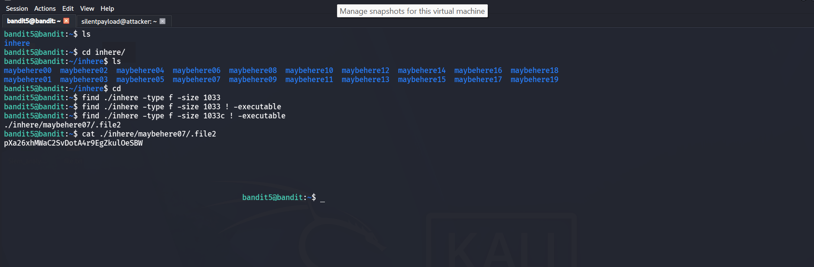

# Bandit: Level 4 → Level 5

## 🎯 The Objective
The password for the next level is stored in a file somewhere under the inhere directory and has all of the following properties:
human-readable
1033 bytes in size
not executable

## 🛠️ Commands used
- `ls`
- `find`
- `cat`

# Solution
`ssh -p 2220 bandit5@bandit.labs.overthewire.org`

After connecting via `ssh` i ran the `ls` command, i saw a directory called *inhere*. I then ran the command `ls ./inhere` and saw so many directories in the directory. I then used the file command that meets the above characteristics (**Look at the objective.**). After finding the path to the file. i then used the `cat /path/to/file` and got the password.
Below is an image of the commands typed:

* **Password: Redacted**
## Concept
**Advanced File Filtering with `find`:**
When navigating complex directory structures, manually inspecting every file is impractical. The Linux `find` command allows security professionals and system administrators to query the filesystem based on precise attributes rather than just file names:
* `-type f`: Restricts the search strictly to files (ignoring directories).
* `-size 1033c`: Locates files that are precisely 1033 bytes in size (the `c` specifies bytes).
* `! -executable`: Negates the executable permission check, ensuring you only target non-executable data or text files.